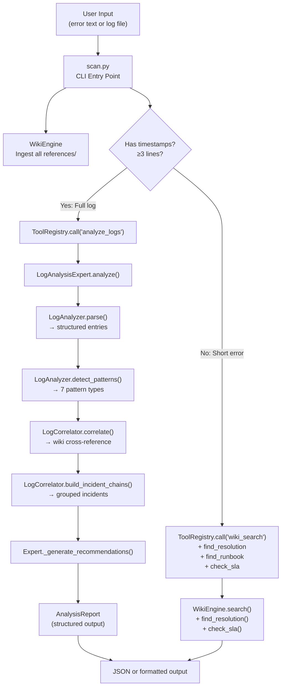

# Cortex Analyst — Complete Codebase Walkthrough

## What This Project Is

**Cortex Analyst** is a production log analysis agent that combines a **documentation knowledge base** with a **log pattern detection engine**. When you paste an error or a log snippet, it:

1. Parses the logs into structured entries
2. Detects patterns (OOM kills, failovers, timeouts, etc.)
3. Cross-references those patterns against ingested documentation (runbooks, troubleshooting guides, SLAs)
4. Extracts root causes and resolution steps from the docs
5. Chains related events into incidents
6. Produces a prioritized report with recommendations

All 21 operations are exposed as **Anthropic-compatible tool definitions** with JSON Schema, so an LLM can autonomously decide which tools to call during an agentic loop.

---

## Project Structure

```
log-analysis-agent/
├── scan.py                          # CLI entry point — instant error scanner
├── src/
│   ├── wiki_engine/__init__.py      # Layer 1: Knowledge base (document ingestion + search)
│   ├── analyzer/__init__.py         # Layer 2: Log parsing + 7 pattern detectors
│   ├── correlator/__init__.py       # Layer 3: Cross-references patterns ↔ wiki docs
│   ├── expert/__init__.py           # Layer 4: Orchestrator + report generator
│   └── tools/__init__.py            # Layer 5: 21 Anthropic-style tool definitions
├── references/                      # Production knowledge base
│   ├── troubleshooting/             # Error code resolution guides
│   ├── runbooks/                    # Step-by-step incident procedures  
│   ├── sla/                         # Service level agreement thresholds
│   ├── specification/               # TMF620 API specs, extended docs
│   └── sample-logs/                 # Real-format incident logs for testing
├── tests/
│   └── test_all.py                  # 43 tests across all subsystems
├── .github/
│   └── copilot-instructions.md      # Instructions for GitHub Copilot integration
├── SKILL.md                         # Claude/Anthropic skill definition
├── STAR.md                          # Interview-ready project summary
├── cost.md                          # Token cost optimization analysis
└── README.md                        # Quick start and architecture overview
```

---

## Data Flow: How a Query Flows Through the System



---

## Module 1: WikiEngine — [wiki_engine/__init__.py](file:///home/rohit/.gemini/antigravity/scratch/log-analysis-agent/src/wiki_engine/__init__.py)

> [!IMPORTANT]
> This is the foundation of the entire system. Without the wiki, the agent can detect patterns but cannot explain *why* they happened or *how* to fix them.

### What It Does
The WikiEngine is a lightweight, in-memory knowledge base. It ingests markdown documents (runbooks, troubleshooting guides, SLAs, API specs), indexes them, and provides keyword-based search with tag bonuses.

### Key Data Structure: `WikiPage`

```python
@dataclass
class WikiPage:
    title: str          # Derived from filename (e.g., "tmf620-troubleshooting")
    content: str        # Full markdown content of the document
    doc_type: str       # "runbook" | "troubleshooting" | "sla" | "specification" | "general"
    source: str         # Filesystem path to the original file
    tags: list[str]     # Auto-extracted tech tags: ["kubernetes", "tmf620", "database", ...]
    
    @property
    def word_set(self) -> set:
        # Tokenizes the entire content into a set of lowercase words
        # Used for keyword overlap search (zero LLM tokens)
        return set(re.findall(r'\b\w+\b', self.content.lower()))
```

### Core Methods

#### `ingest_file(path, doc_type, tags)` → WikiPage
Reads a file from disk, creates a `WikiPage`, stores it in `self._pages[title]`, and indexes its tags.

#### `ingest_directory(dir_path)` → int
Bulk-loads all `.md` and `.txt` files from a directory. For each file:
1. **Auto-detects doc_type** via `_infer_type()` — checks filename for keywords like "runbook", "troubleshoot", "sla", "spec"
2. **Auto-extracts tags** via `_extract_tags()` — reads the first 2000 chars and checks for technology keywords (kubernetes, postgres, redis, elasticsearch, tmf620, errors, performance, memory)

#### `search(query, top_k=5, doc_type=None)` → list[tuple[float, WikiPage]]
The search algorithm is **deterministic keyword overlap** (zero LLM tokens):

```
score = len(query_words ∩ page_words) + tag_bonus
```

- `query_words`: set of all words in the query
- `page_words`: set of all words in the page content (the `word_set` property)
- `tag_bonus`: +2 for each page tag that appears in the query

Results are sorted by descending score and capped at `top_k`.

> [!NOTE]
> This is intentionally simple. The design philosophy is that **deterministic search costs zero LLM tokens** — all the "intelligence" is deferred to the LLM layer that interprets the results. The wiki just needs to find plausibly relevant documents.

#### `find_resolution(error_code)` → list[WikiPage]
Searches for the error code, then filters to only pages where the error code literally appears in the content.

#### `find_runbook(scenario)` → list[WikiPage]
Searches with `doc_type="runbook"` filter.

#### `check_sla(metric, value)` → Optional[dict]
Searches for SLA documents, then uses regex to extract numeric thresholds from patterns like `500ms` or `99.95%`. Returns whether the observed value breaches the threshold:

```python
{"metric": "latency", "value": 2800, "threshold": 500.0, "breached": True, "source": "references/sla/tmf620-sla.md"}
```

### Internal Storage

```python
self._pages: dict[str, WikiPage] = {}      # title → WikiPage
self._tag_index: dict[str, list[str]] = {}  # tag → [title1, title2, ...]
```

---

## Module 2: LogAnalyzer — [analyzer/__init__.py](file:///home/rohit/.gemini/antigravity/scratch/log-analysis-agent/src/analyzer/__init__.py)

### What It Does
Parses raw log text into structured `LogEntry` objects and runs 7 pattern detectors over them.

### Key Data Structures

#### `LogEntry`
```python
@dataclass
class LogEntry:
    timestamp: str       # "2026-04-26T08:12:01Z"
    severity: Severity   # INFO | WARN | ERROR | CRITICAL
    service: str         # "[tmf620-api]"
    message: str         # "ERR-4001 Invalid product specification reference"
    raw: str             # Original line
    line_number: int     # Line position in the log file
```

Three computed properties:
- `is_error` → `True` if severity is ERROR or CRITICAL
- `error_codes` → list of `ERR-NNNN` codes found in the message (regex: `r'ERR-\d{4}'`)
- `http_status` → extracts 4xx/5xx HTTP status codes from the message

#### `PatternMatch`
```python
@dataclass
class PatternMatch:
    pattern_name: str       # "ERR-4001", "OOM Kill", "Failover Event"
    pattern_type: str       # "error_code", "oom", "failover", "timeout", "latency_spike", "cache_issue", "db_connection"
    entries: list[LogEntry] # The log entries that matched this pattern
    description: str        # Human-readable description
    severity: Severity      # Assigned severity for this pattern
    affected_service: str   # Which service is affected
```

### Log Parser

The parser uses a single regex to extract structured fields:

```python
LOG_PATTERN = re.compile(
    r'(\d{4}-\d{2}-\d{2}T\d{2}:\d{2}:\d{2}Z)\s+'  # ISO 8601 timestamp
    r'(INFO|WARN|ERROR|CRITICAL)\s+'                  # Severity level
    r'\[([^\]]+)\]\s+'                                 # Service name in brackets
    r'(.*)'                                            # Message (everything else)
)
```

Expected log format:
```
2026-04-26T08:12:01Z ERROR [tmf620-api] ERR-4001 Invalid product specification reference
```

### The 7 Pattern Detectors

Each detector scans the list of parsed `LogEntry` objects and returns `PatternMatch` objects:

| # | Detector Method | Pattern Type | What It Matches | Severity |
|---|----------------|--------------|-----------------|----------|
| 1 | `_detect_error_codes` | `error_code` | `ERR-NNNN` regex matches — groups by unique code | ERROR |
| 2 | `_detect_oom_kills` | `oom` | "oom", "exit code 137", "memory"+"kill" | CRITICAL |
| 3 | `_detect_failovers` | `failover` | "failover", "promoting replica", "split-brain" | ERROR |
| 4 | `_detect_timeouts` | `timeout` | "timeout" | ERROR |
| 5 | `_detect_latency_spikes` | `latency_spike` | "latency spike", "slow query", P95+digits+ms | WARN |
| 6 | `_detect_cache_issues` | `cache_issue` | "cache" + ("hit rate" or "exhausted") | WARN |
| 7 | `_detect_db_issues` | `db_connection` | "connection" + ("refused" or "pool") | ERROR |

### Filters

- `filter_by_severity(entries, min_severity)` — returns only entries at or above the given level
- `filter_by_service(entries, service)` — case-insensitive substring match on service name
- `filter_by_time_range(entries, start, end)` — ISO timestamp string comparison

---

## Module 3: LogCorrelator — [correlator/__init__.py](file:///home/rohit/.gemini/antigravity/scratch/log-analysis-agent/src/correlator/__init__.py)

> [!TIP]
> The correlator is where the magic happens — it connects **what happened** (patterns from the analyzer) with **why it happened and how to fix it** (knowledge from the wiki).

### What It Does
Takes the patterns detected by the Analyzer and cross-references each one against the WikiEngine to:
1. Find relevant documentation
2. Extract root cause text
3. Extract resolution steps
4. Check SLA thresholds
5. Score confidence
6. Chain related patterns into incidents

### Key Data Structures

#### `Correlation`
```python
@dataclass
class Correlation:
    pattern: PatternMatch          # The detected pattern
    wiki_pages: list[dict]         # [{title, doc_type, relevance, source}]
    root_cause: str                # Extracted from wiki ("The productSpecification field references...")
    resolution_steps: list[str]    # Extracted numbered steps
    sla_breach: Optional[dict]     # {"metric", "value", "threshold", "breached"}
    confidence: float              # 0.0–1.0
```

#### `IncidentChain`
```python
@dataclass
class IncidentChain:
    chain_id: str                  # "INC-001"
    correlations: list[Correlation]
    timeline: list[str]            # ["[2026-04-26T08:12:01Z] Error code ERR-4001..."]
    blast_radius: list[str]        # ["tmf620-api", "pricing-engine"]
    severity: Severity             # Worst severity in the chain
    total_duration_estimate: str   # "08:12:01Z → 08:35:02Z"
```

### The Correlation Algorithm

For each `PatternMatch`, `_correlate_pattern()` does:

**Step 1: Build a smart search query**
```python
query_parts = [pattern.pattern_name, pattern.affected_service]
# + error codes from the first 3 entries  
# + context terms: "memory OOM Kubernetes" for OOM, "failover database recovery" for failovers, etc.
```

**Step 2: Search the wiki**
```python
wiki_results = self.wiki.search(query, top_k=5)
```

**Step 3: Extract root cause** from the top wiki match
- Looks for `**Root Cause:**` markdown pattern
- Falls back to `Symptom:` sections
- Falls back to "Root cause not explicitly documented in wiki"

**Step 4: Extract resolution steps**
- Matches numbered steps: `1. ...` or `Step 1: ...`
- Matches bullet steps under `## Resolution` headings
- Caps at 10 steps

**Step 5: Check SLA** (for latency_spike and timeout patterns only)
- Extracts `NNNms` values from log messages
- Calls `WikiEngine.check_sla()` to compare against documented thresholds

**Step 6: Score confidence** (0.0–1.0)
```
base = min(top_wiki_score / max_possible_score, 1.0)
+ 0.15 bonus if error code literally appears in wiki page
+ 0.10 bonus if a runbook was matched  
```
Without any wiki match: confidence = 0.2

### Incident Chaining

`build_incident_chains()` groups correlations together if they are **related**:

Two correlations are related if:
- They affect the **same service**, OR
- They share **overlapping wiki pages** (same document was relevant to both)

For example, an OOM kill on `k8s-pod` and a CrashLoopBackOff on `k8s-pod` would be chained together because they share the same service.

Each chain gets:
- A unique ID (`INC-001`, `INC-002`, ...)
- The **worst severity** across all correlations in the chain
- A **blast radius** (list of all affected services)
- A **timeline** built from the timestamps of all entries
- A **duration estimate** (first timestamp → last timestamp)

---

## Module 4: LogAnalysisExpert — [expert/__init__.py](file:///home/rohit/.gemini/antigravity/scratch/log-analysis-agent/src/expert/__init__.py)

### What It Does
The Expert is the **orchestrator**. It chains together the Analyzer, Correlator, and WikiEngine into a single `analyze()` call that produces a complete `AnalysisReport`.

### The 8-Step Analysis Pipeline

```python
def analyze(self, log_text: str, source: str = "logs") -> AnalysisReport:
    # Step 1: Parse raw logs → structured entries
    entries = self.analyzer.parse(log_text)
    
    # Step 2: Filter to errors/warnings
    errors_warnings = self.analyzer.filter_by_severity(entries, Severity.WARN)
    
    # Step 3: Detect patterns (7 types)
    patterns = self.analyzer.detect_patterns(entries)
    
    # Step 4: Correlate patterns with wiki docs
    correlations = self.correlator.correlate(patterns)
    
    # Step 5: Chain related correlations into incidents
    chains = self.correlator.build_incident_chains(correlations)
    
    # Step 6: Generate prioritized recommendations
    recommendations = self._generate_recommendations(correlations, chains)
    
    # Step 7: Collect SLA breaches
    sla_breaches = [c.sla_breach for c in correlations if c.sla_breach and c.sla_breach.get("breached")]
    
    # Step 8: Calculate overall confidence (average across all correlations)
    confidence = sum(c.confidence for c in correlations) / len(correlations)
```

### AnalysisReport

The `AnalysisReport` dataclass contains everything:

```python
@dataclass
class AnalysisReport:
    report_id: str                   # "LAR-1714123456"
    summary: str                     # "Analyzed 38 entries, found 10 errors, detected 8 patterns..."
    severity: Severity               # Overall: CRITICAL if any CRITICAL pattern, else ERROR, etc.
    total_entries: int
    error_count: int
    warning_count: int
    patterns_detected: list[dict]    # [{name, type, entries, service}]
    incident_chains: list[dict]      # [{chain_id, severity, blast_radius, timeline, correlations}]
    recommendations: list[dict]      # [{title, priority, confidence, description, action}]
    sla_breaches: list[dict]         # [{metric, value, threshold, source}]
    wiki_sources_used: list[str]     # Titles of all wiki pages consulted
    confidence: float                # 0.0–1.0 average
    analysis_time_ms: float          # Wall-clock time for the analysis
```

It also has a `to_markdown()` method that generates a full, human-readable report with sections for:
- Executive Summary
- Statistics table
- Incident Chains (with timeline, correlations, root causes, resolution steps, SLA breaches)
- Recommendations (prioritized)
- Knowledge Sources

### Recommendation Generation

Recommendations are built from correlations that have:
- A **non-generic root cause** (not "Root cause not explicitly documented in wiki")
- **SLA breaches** get automatic HIGH priority recommendations

Sorted by: priority (HIGH first) → confidence (highest first), capped at 10.

---

## Module 5: ToolRegistry — [tools/__init__.py](file:///home/rohit/.gemini/antigravity/scratch/log-analysis-agent/src/tools/__init__.py)

> [!IMPORTANT]
> This is the external interface. Everything in the codebase is accessed through the ToolRegistry. It follows Anthropic's tool-use specification exactly so an LLM can autonomously call these tools.

### What It Does
Registers 21 tools across 4 categories, each with:
- **name**: matches `^[a-zA-Z0-9_-]{1,64}$`
- **description**: 50+ char explanation of what/when/how to use the tool
- **input_schema**: JSON Schema defining parameters with types, required fields, enum values
- **input_examples**: optional example inputs
- **handler**: Python function that implements the tool

### Tool Categories

#### ANALYZE (5 tools)
| Tool | Handler | What It Does |
|------|---------|-------------|
| `analyze_logs` | `_analyze_logs` | Runs the full Expert pipeline on raw log text. Stores the report for later retrieval. |
| `analyze_file` | `_analyze_file` | Same as above but reads from a file path. Checks `os.path.exists()` first. |
| `parse_logs` | `_parse_logs` | Quick parse only — returns structured entries without pattern detection or wiki correlation. |
| `extract_errors` | `_extract_errors` | Parses and filters to ERROR/CRITICAL only. Returns error codes for each. |
| `filter_by_service` | `_filter_by_service` | Parses and filters to a specific service name. |

#### KNOWLEDGE (6 tools)
| Tool | Handler | What It Does |
|------|---------|-------------|
| `wiki_search` | `_wiki_search` | Searches the wiki with optional doc_type filter and top_k limit. |
| `ingest_document` | `_ingest_document` | Adds a single file to the wiki. |
| `ingest_directory` | `_ingest_directory` | Bulk-loads all `.md`/`.txt` files from a directory. |
| `find_runbook` | `_find_runbook` | Searches specifically for runbook-type documents. |
| `find_resolution` | `_find_resolution` | Finds wiki pages containing a specific error code. |
| `check_sla` | `_check_sla` | Checks a metric value against SLA thresholds in wiki. |

#### REPORT (7 tools)
| Tool | Handler | What It Does |
|------|---------|-------------|
| `get_summary` | `_get_summary` | Returns analysis summary (requires prior `analyze_logs`). |
| `get_patterns` | `_get_patterns` | Returns all detected patterns. |
| `get_incidents` | `_get_incidents` | Returns incident chains with timelines. |
| `get_recommendations` | `_get_recommendations` | Returns prioritized action items. |
| `get_timeline` | `_get_timeline` | Returns chronological event timeline. |
| `get_report` | `_get_report` | Generates full markdown report via `AnalysisReport.to_markdown()`. |
| `ask_question` | `_ask_question` | Q&A — searches wiki + analysis results to answer a question. |

#### UTILS (3 tools)
| Tool | Handler | What It Does |
|------|---------|-------------|
| `health_check` | `_health_check` | Returns wiki load state, page count, tool count. |
| `get_stats` | `_get_stats` | Wiki stats + last report ID + call count. |
| `list_tools` | `_list_tools` | Lists all available tools with descriptions. |

### Execution Interface

```python
# Call a tool by name
result = registry.call("analyze_logs", log_text="...")

# result is a ToolResult:
#   result.output  → human-readable string summary
#   result.data    → structured dict with all data
#   result.is_error → True if something went wrong
```

### Anthropic API Export

```python
# Get all tool definitions in Anthropic format
definitions = registry.get_tool_definitions()
# → list of {name, description, input_schema, input_examples}

# Get a system prompt with tool descriptions embedded
prompt = registry.get_system_prompt()
# → "You are Cortex Analyst, an expert log analysis agent with access to the following tools..."
```

### Call Logging
Every tool call is logged to `self._call_log` with the tool name, input, timestamp, and duration in ms.

---

## Module 6: scan.py — [scan.py](file:///home/rohit/.gemini/antigravity/scratch/log-analysis-agent/scan.py)

### What It Does
The CLI entry point. Takes user input (error text or log file), runs the appropriate analysis, and outputs either formatted text or JSON.

### Two Modes

**Mode 1: Log Analysis** (has timestamps + ≥3 lines)
```bash
python3 scan.py < incident.log
```
1. Ingests all reference docs
2. Calls `analyze_logs` → full expert pipeline
3. Calls `get_patterns`, `get_incidents`, `get_recommendations`
4. Outputs patterns, recommendations, and incident chains

**Mode 2: Error Lookup** (short error text, no timestamps)
```bash
python3 scan.py "ERR-4001 Invalid product specification"
```
1. Ingests all reference docs
2. Extracts `ERR-NNNN` codes via regex
3. Searches wiki for the full text
4. Finds resolution pages for each error code
5. Finds matching runbooks
6. Checks SLA if a latency value (`NNNms`) is mentioned

### Input Methods
```bash
# Command-line argument
python3 scan.py "ERR-4001 Invalid specification"

# Pipe from stdin
echo "OOMKilled exit code 137" | python3 scan.py

# File redirect
python3 scan.py < incident.log

# JSON output
python3 scan.py "ERR-4001" --json
```

### Output Formatting

The `format_output()` function produces emoji-rich, structured output:

```
🧠 CORTEX ANALYST — Log Analysis
==================================================
Severity: CRITICAL
Entries: 38 | Errors: 10
Patterns: 8 | Incidents: 3
Confidence: 65%

🔎 PATTERNS (8):
  • ERR-4001 [error_code] in tmf620-api
  • OOM Kill [oom] in k8s-pod
  • Failover Event [failover] in postgres
  ...

💡 RECOMMENDATIONS (5):
  [HIGH] Investigate ERR-4001
     → Verify the specification ID exists: GET /productSpecification/{id}; ...

🔗 INC-001 [CRITICAL]
  Blast: tmf620-api, k8s-pod
  ├─ ERR-4001 (error_code) [65%]
  │  Root: The productSpecification field references an ID...
  │  Steps: 4 found
```

---

## Reference Knowledge Base

### [references/troubleshooting/tmf620-troubleshooting.md](file:///home/rohit/.gemini/antigravity/scratch/log-analysis-agent/references/troubleshooting/tmf620-troubleshooting.md)

Covers 5 TMF620 error codes with structured sections:
- **ERR-4001** — Invalid specification reference (spec in wrong lifecycle state)
- **ERR-4091** — Duplicate product offering name
- **ERR-5001** — Stale search index (Elasticsearch out of sync)
- **ERR-4221** — Cannot delete offering (active subscriptions)
- **ERR-4003** — Invalid lifecycle state transition

Each entry has: Symptom, Root Cause, Resolution Steps, Prevention.

### [references/runbooks/emergency-catalog-recovery.md](file:///home/rohit/.gemini/antigravity/scratch/log-analysis-agent/references/runbooks/emergency-catalog-recovery.md)

P1 runbook with 3 scenarios:
1. **Complete API unavailability** — check pods, rollback, database
2. **Stale catalog data** — reindex Elasticsearch
3. **Performance degradation** — cache, slow queries, scaling

### [references/sla/tmf620-sla.md](file:///home/rohit/.gemini/antigravity/scratch/log-analysis-agent/references/sla/tmf620-sla.md)

Latency thresholds per endpoint (P50/P95/P99), availability target (99.95%), error budget, P1 response time.

### [references/specification/](file:///home/rohit/.gemini/antigravity/scratch/log-analysis-agent/references/specification/)

4 extended docs: TMF620 API specification, runbook, SLA details, and troubleshooting guide.

### [references/sample-logs/tmf620-incident.log](file:///home/rohit/.gemini/antigravity/scratch/log-analysis-agent/references/sample-logs/tmf620-incident.log)

A realistic 38-line production incident log covering a cascading failure:
```
08:12 → ERR-4001 spec reference error
08:15 → ERR-4091 duplicate offering
08:18 → ERR-5002 pricing timeout + connection pool exhaustion
08:22 → ERR-5001 stale search index
08:25 → ERR-4003 invalid lifecycle transition
08:28 → ERR-4221 cannot delete (active subscriptions)
08:30 → CRITICAL: health check failed → CrashLoopBackOff → OOM Kill
08:31 → PostgreSQL failover (Patroni)
08:33 → Redis split-brain
08:35 → P95 latency spike 2800ms + cache hit rate 42% + query timeout 8200ms
08:36 → Index creation + recovery
```

---

## Test Suite — [tests/test_all.py](file:///home/rohit/.gemini/antigravity/scratch/log-analysis-agent/tests/test_all.py)

43 tests organized by module:

### TestWiki (6 tests)
- File ingestion, directory ingestion, search, resolution lookup, runbook lookup, SLA checking

### TestAnalyzer (6 tests)
- Log parsing (≥15 entries from sample), error code extraction, pattern detection (≥5 patterns), OOM detection (exactly 1), failover detection (≥1), file parsing (≥20 entries)

### TestExpert (3 tests)
- Full analysis (entries > 0, patterns ≥ 5, severity ERROR or CRITICAL), file analysis, markdown report generation

### TestToolRegistry (22 tests)
- Tool count (≥20), Anthropic format export, system prompt, unknown tool error, and one test per tool verifying correct behavior

### TestEndToEnd (2 tests)
- **Full agent workflow**: simulates a 7-step agentic loop (ingest docs → analyze file → ask question → check SLA → find runbook → generate report → export tool defs)
- **Schema validity**: every tool definition has a name ≥1 char, description ≥50 chars, type=object schema, and typed properties

---

## Meta Files

### [SKILL.md](file:///home/rohit/.gemini/antigravity/scratch/log-analysis-agent/SKILL.md)
Anthropic/Claude skill definition with YAML frontmatter. Tells the LLM how to use the system:
1. Run `scan.py` with the user's error text
2. Read relevant reference docs based on scan output
3. Produce a structured analysis report with severity, root cause, impact, resolution steps, recommendations

### [.github/copilot-instructions.md](file:///home/rohit/.gemini/antigravity/scratch/log-analysis-agent/.github/copilot-instructions.md)
GitHub Copilot integration — same workflow adapted for Copilot's instruction format.

### [STAR.md](file:///home/rohit/.gemini/antigravity/scratch/log-analysis-agent/STAR.md)
Interview-ready STAR-format summary covering Situation, Task, Action, Result, and follow-up Q&A about tool-use specification, agentic loops, and LLM integration.

### [cost.md](file:///home/rohit/.gemini/antigravity/scratch/log-analysis-agent/cost.md)
Analysis of token cost savings from using deterministic keyword search vs. brute-force document injection vs. vector embeddings.

---

## Key Design Decisions

### 1. Zero External Dependencies
The entire codebase uses only Python standard library. No `pip install` required. This means:
- No vector database (no Pinecone, Chroma, FAISS)
- No embedding models (no OpenAI, Sentence Transformers)
- No web frameworks (no Flask, FastAPI)
- No ML libraries

### 2. Deterministic Search Over Semantic Search
The wiki search is simple keyword overlap + tag bonus. This is intentional:
- **Zero LLM tokens** — the search itself costs nothing
- **Predictable** — same query always returns same results
- **Fast** — pure Python set operations, ~100ms for the entire pipeline
- **Good enough** — the LLM interprets the results, not the search engine

### 3. Separation of Detection vs. Interpretation
The code only does **detection** (parsing, pattern matching, wiki lookup). The **interpretation** (explaining why, recommending fixes, assessing risk) is left to the LLM layer defined in SKILL.md. This is the "hybrid analysis" architecture — deterministic Layer 1 + LLM Layer 2.

### 4. Anthropic Tool-Use Specification
All 21 tools follow the exact Anthropic format: `{name, description, input_schema}`. This means the system is immediately pluggable into any Anthropic API client — export `get_tool_definitions()`, handle `tool_use` blocks, call `registry.call()`, return `tool_result`.
